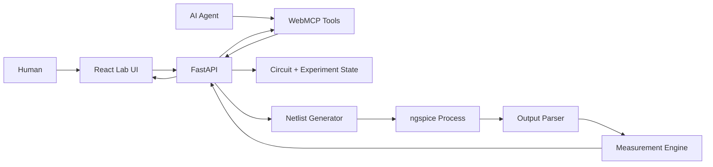
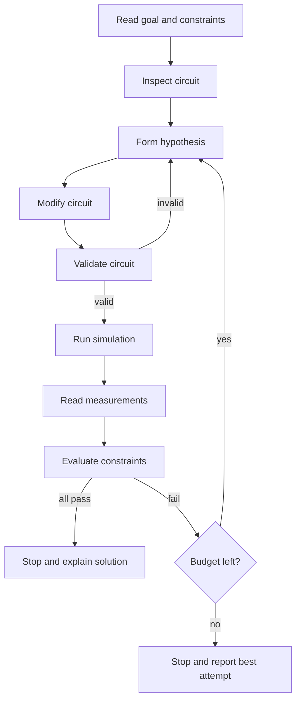

# Autonomous Virtual Electronics Lab
## Master Implementation Specification

**Status:** Build-ready  
**Target:** 2 to 3 day hackathon MVP  
**Primary goal:** Build a browser-based electronics sandbox that both a human and an AI agent can operate. The user gives an engineering goal. The agent decides how to solve it by editing a circuit, running real simulations, observing results, and iterating.

---

## 1. Product in one sentence

> A shared virtual electronics lab where humans specify outcomes and AI agents use WebMCP tools to experimentally design, test, optimize, and debug small analog circuits.

This is not an AI filter calculator and not a general PCB editor.

The core interaction is:

```text
User goal
   ↓
Agent inspects current lab
   ↓
Agent forms a hypothesis
   ↓
Agent changes the circuit
   ↓
Agent runs a real simulation
   ↓
Agent reads structured measurements
   ↓
Agent decides what to try next
   ↓
Repeat until success, budget exhaustion, or user intervention
```

---

## 2. Product thesis

Most AI engineering demos ask a model to directly output an answer.

This project gives the model a **laboratory** instead.

The agent is allowed to be wrong. It must test its ideas against a deterministic circuit simulator before claiming success.

Key principle:

> The LLM does the reasoning. ngspice does the physics.

---

## 3. Flagship use case

### Sensor Interface Challenge

A user provides a high-level objective such as:

> "This sensor produces a noisy signal between 20 mV and 150 mV. Make it safe and useful for a 0 to 3.3 V microcontroller ADC. Preserve the useful low-frequency signal, reduce high-frequency noise, avoid clipping, and use no more than 10 components."

The agent may decide to:

1. inspect the source signal,
2. add amplification,
3. add filtering,
4. adjust biasing,
5. add output protection,
6. run AC and transient simulations,
7. measure gain, max voltage, response time, and attenuation,
8. revise the circuit,
9. stop only after constraints pass.

The prompt may be:
- open-ended,
- partially guided,
- or highly constrained.

The lab must support all three.

---

## 4. Secondary use cases

### Design
"Design a circuit that passes frequencies below 500 Hz and attenuates 10 kHz by at least 30 dB."

### Optimize
"Reduce noise without increasing settling time beyond 20 ms."

### Debug
"This amplifier clips above 70% input. Find the cause and fix it without reducing gain below 10."

All three use the same underlying circuit model, simulator, UI, and WebMCP tools.

---

## 5. Scope

### MVP must support

- browser circuit canvas,
- human circuit editing,
- agent circuit editing through WebMCP,
- resistor,
- capacitor,
- inductor,
- independent voltage source,
- diode,
- ideal or simplified op-amp,
- ground,
- AC analysis,
- transient analysis,
- operating-point analysis,
- structured measurements,
- experiment history,
- constraint evaluation,
- experiment budget,
- save and restore experiment snapshots,
- three polished challenge templates,
- actual ngspice simulation.

### Optional if core is stable

- parameter sweep,
- BJT or MOSFET,
- Monte Carlo tolerances,
- side-by-side experiment comparison,
- shareable challenge links.

### Explicit non-goals

Do not build:

- PCB layout,
- autorouting,
- manufacturing output,
- hundreds of real manufacturer components,
- microcontroller firmware simulation,
- RF simulation,
- switching power electronics,
- thermal simulation,
- full KiCad clone,
- drag-perfect professional schematic capture,
- SPICE model marketplace,
- AI-specific optimizer endpoints,
- custom circuit solver.

---

## 6. Recommended stack

### Frontend

- Next.js
- React
- TypeScript
- React Flow for circuit graph/canvas
- lightweight chart library such as Recharts, ECharts, or Plotly
- Zustand or React context for client state

### Backend

- Python 3.12
- FastAPI
- Pydantic
- ngspice CLI invoked as a sandboxed subprocess
- SQLite for experiments and challenge state
- pytest

### Why this split

Python makes ngspice integration and numeric processing simple. React makes the shared human-agent visual workspace simple.

---

## 7. High-level architecture



Both the human UI and agent tools must mutate the same canonical backend state.

---

## 8. Canonical data ownership

The backend is the source of truth.

Do not let the frontend own the authoritative circuit.

Every circuit mutation follows:

```text
UI or WebMCP request
      ↓
FastAPI command
      ↓
Validate
      ↓
Update canonical circuit state
      ↓
Persist
      ↓
Return new revision
      ↓
Frontend refreshes
```

Every circuit has a monotonically increasing `revision`.

This prevents stale human and agent edits from silently overwriting one another.

---

## 9. Repository structure

```text
/
├── frontend/
│   ├── app/
│   ├── components/
│   │   ├── LabCanvas/
│   │   ├── ComponentTray/
│   │   ├── GoalPanel/
│   │   ├── SimulationPanel/
│   │   ├── MeasurementsPanel/
│   │   └── ExperimentTimeline/
│   ├── lib/
│   └── tests/
│
├── backend/
│   ├── app/
│   │   ├── main.py
│   │   ├── api/
│   │   ├── models/
│   │   ├── services/
│   │   │   ├── circuit_service.py
│   │   │   ├── netlist_service.py
│   │   │   ├── simulation_service.py
│   │   │   ├── measurement_service.py
│   │   │   ├── constraint_service.py
│   │   │   └── experiment_service.py
│   │   ├── webmcp/
│   │   └── db/
│   └── tests/
│
├── shared/
│   └── schemas/
│
├── examples/
│   ├── filter/
│   ├── sensor_interface/
│   └── debug_amplifier/
│
├── scripts/
│   ├── verify_ngspice.py
│   └── smoke_test.py
│
├── docker/
├── AGENTS.md
└── README.md
```

---

## 10. Core backend modules

### Circuit service

Responsibilities:
- create challenge circuit,
- add/remove components,
- connect/disconnect pins,
- set values,
- validate graph,
- version state.

### Netlist service

Responsibilities:
- convert circuit JSON into valid SPICE,
- map logical nodes to SPICE node names,
- add simulation directives,
- generate deterministic netlists.

### Simulation service

Responsibilities:
- create temporary working directory,
- invoke ngspice,
- apply timeout,
- capture stdout/stderr,
- parse simulator success/failure,
- delete temp files.

### Measurement service

Responsibilities:
- turn vectors into small engineering facts,
- gain,
- cutoff frequency,
- max/min voltage,
- rise time,
- overshoot,
- settling time.

### Constraint service

Responsibilities:
- compare measurements with challenge requirements,
- return machine-readable PASS/FAIL,
- calculate progress.

### Experiment service

Responsibilities:
- snapshot circuit,
- store hypothesis,
- store simulation summary,
- store constraints,
- restore/fork experiments.

---

## 11. Circuit JSON model

Canonical example:

```json
{
  "id": "ckt_123",
  "revision": 7,
  "name": "Sensor Front End",
  "components": [
    {
      "id": "V1",
      "type": "voltage_source",
      "params": {
        "mode": "sine",
        "offset_v": 0.08,
        "amplitude_v": 0.06,
        "frequency_hz": 10
      },
      "pins": {
        "positive": "sensor",
        "negative": "gnd"
      }
    },
    {
      "id": "R1",
      "type": "resistor",
      "params": {
        "resistance_ohm": 10000
      },
      "pins": {
        "a": "sensor",
        "b": "out"
      }
    },
    {
      "id": "C1",
      "type": "capacitor",
      "params": {
        "capacitance_f": 1e-7
      },
      "pins": {
        "a": "out",
        "b": "gnd"
      }
    }
  ],
  "nodes": [
    {"id": "gnd", "label": "Ground"},
    {"id": "sensor", "label": "Sensor"},
    {"id": "out", "label": "Output"}
  ],
  "metadata": {
    "input_node": "sensor",
    "output_node": "out"
  }
}
```

---

## 12. Challenge model

```json
{
  "id": "challenge_sensor_01",
  "title": "Sensor Interface",
  "description": "Condition a noisy sensor signal for a 3.3 V ADC.",
  "experiment_budget": 15,
  "component_limit": 10,
  "allowed_components": [
    "resistor",
    "capacitor",
    "inductor",
    "diode",
    "ideal_opamp",
    "voltage_source",
    "ground"
  ],
  "constraints": [
    {
      "id": "max_voltage",
      "metric": "max_output_voltage_v",
      "operator": "<=",
      "target": 3.3
    },
    {
      "id": "min_gain",
      "metric": "gain_at_10hz",
      "operator": ">=",
      "target": 10
    },
    {
      "id": "hf_rejection",
      "metric": "gain_db_at_10000hz",
      "operator": "<=",
      "target": -20
    }
  ]
}
```

---

## 13. Simulation result contract

Every simulation endpoint returns this shape.

```json
{
  "success": true,
  "analysis": "ac",
  "circuit_revision": 7,
  "simulation_id": "sim_456",
  "summary": {
    "points": 401,
    "duration_ms": 87
  },
  "measurements": {
    "gain_db_at_500hz": -0.72,
    "gain_db_at_10000hz": -31.8,
    "cutoff_frequency_hz": 1123.4
  },
  "series": {
    "frequency_hz": [10, 20, 50],
    "output_gain_db": [-0.01, -0.02, -0.1]
  },
  "warnings": [],
  "errors": []
}
```

On failure:

```json
{
  "success": false,
  "analysis": "ac",
  "circuit_revision": 7,
  "simulation_id": "sim_456",
  "measurements": {},
  "series": {},
  "warnings": [],
  "errors": [
    {
      "code": "SIMULATION_FAILED",
      "message": "ngspice could not converge.",
      "details": "timestep too small"
    }
  ]
}
```

Never expose raw simulator stdout to the agent by default.

---

## 14. Agent loop



Do not implement a backend `optimize_design()` function. The loop above must happen through agent reasoning and primitive tools.

---

## 15. Definition of done

The MVP is complete when all items below work in one deployed app:

- A human can open the lab and edit a circuit.
- An agent can inspect and edit the same circuit through WebMCP.
- Circuit changes are visible to the human without refreshing the page.
- AC simulation runs through real ngspice.
- Transient simulation runs through real ngspice.
- Operating-point simulation runs through real ngspice.
- At least five structured measurements work.
- Constraints are automatically evaluated.
- Each simulation can be saved as an experiment.
- Experiment count visibly decreases from a fixed budget.
- A previous experiment can be restored.
- Sensor Interface demo works.
- Filter demo works.
- Debug demo works.
- At least one demo visibly requires multiple experiments before success.
- No special-purpose endpoint directly solves the challenge for the agent.

---

## 16. Product success test

A judge should be able to understand the product from this 30-second interaction:

1. User opens a challenge.
2. User says: "Make this sensor safe for a 3.3 V ADC and clean up its noise. You have 10 experiments."
3. Agent inspects the existing source.
4. Agent builds a circuit.
5. The circuit appears live on the canvas.
6. Agent runs simulation.
7. Graph changes.
8. One requirement fails.
9. Agent explains what failed and changes the design.
10. New simulation passes.
11. UI shows all constraints green.

If this flow is reliable, polish it before adding more domain features.
